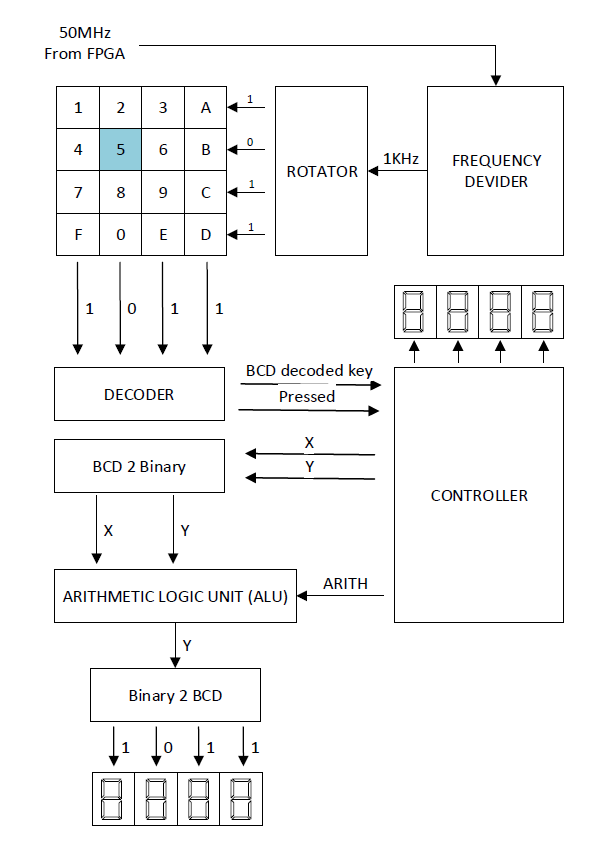

# calculator-vhdl
Calculator on a FPGA using VHDL

## Description 
The goal of this project is to design a calculator in VHSIC Hardware Description Language
(VHDL) that can add- subtract and multiply two user-input values.
The user inputs values via a key pad that is connected to the Altera Development and Education Board II (DE2). The input is displayed on four 7-segmented displays integrated
on the DE2.

The software Quartus II 13.0.1bsp 64bit is used to write and compile the VHDL code into the integrated Field-programmable gate array: (FPGA) Cyclone II . 
Simulations are preformed in ModelSim Altera v10.1d to verify and demonstrate software components.

An overview of the developed system is shown below

## Authors
Elvis Rodas, Patrik Wall.
